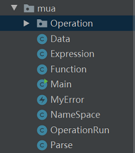

# MUA-Interpreter
> The final project for the course *Principle of Programming Language*.

It's an interpreter for the functional programming language Mua implemented in Java.
*Notice: This is not the final version and will be updated soon...*

## What's Mua?

Mua (**M**ade-**u**p l**a**nguage) is a functional programming language created by my instructor Kai Weng.
It is well defined and can be easily parsed without the knowledge of compiling principle.

#### Basic Concept

+ Mua is made up of **several operation lists**. Typically a operation list is written in one line, but you can split them in several lines if you like, especially for function definition.
+ Each unit is seperated by ***space***. In mua, *space* is a generalized concept including space, tab and enter.
+ Consider the concept of ***literal notation***: If you want to create a variable in your code, you may use some *notation* to let the interpreter know the *type* of it. But it's just a representation. i.e. Actually this variable doesn't contain this *notation*.
+ There are four primitive data types in mua: `number`, `word`, `bool`, `list`.
	- `number`: Mua doesn't distinguish float or integer. All Numbers will be stored as float.
    - `word`: This type is similar to that we called *string*. Note the *literal notation* of *word* is a starting character `"`, and all the characters before the next *space* belong to this *word*. In particular, we suppose that *word* will not contain characters `[` or `]`.
    - `bool`: Only two value can be assigned and calculated: `true` and `false`.
    - `list`: The *literal notation* of *list* is a pair of bracket (Starts with `[` and ends with `]`). The interpreter will seperate the content inside the bracket by spaces, and each of them serves as a element in this *list*. Note *list* can be nested, like `[1234.0 2 "Hello [true "false]]`.
+ Although stored as `word`, elements should be *changed automatically* if necessary. For example, the value of `or true "false` is `true`, and the value of `add "1.0 2` is `3.0`.
+ `name` is a subset of *word* which satisfied that all its characters are in `[0-9, A-Z, a-z, _]` and the first character isn't a digit. *name* is used to define variables and functions, and is case sensitive.
+ Besides **functions** which will be executed **in prefix order**, Mua support **expressions** which will be calculated **in infix way**. To maintain clearer phrases and commands, parentheses should surround outside the expression. e.g. `sub (1 + eq true :a) :b` is a legal expression. Of course expressions can be nested.

#### Important Tips to Comprehend Mua

+ Review the definition of `list`: All the elements seperated by space belong to  it without parsing. So *list* `[(2+4)]` $\ne$ *list* `[6]`, and *list* `[(2 +4)]` will be stored as `(2` and `+4`.
+ A great advantange of mua is: The interpreter can easily distinguish a phrase by looking at its first character.
	- If it is `"`, then a `word` comes later.
	- If it is a digit or `-`, then a `number` comes later.
	- If it is `[`, then a `list` comes later.
	- If it is `(`, then a expression comes later.
	- If it is in `[+,-,*,/,%]`, then it is a operator.
	- Otherwise, if this phrase isn't equal to `true` or `false`(In this case, a `bool` comes later), then it must be a function.
+ You may find that `make` has two functions in the following description, one for **variable** definition and the other for **function** definition. Actually they can be considered the same, because *functions* are just the *list* where both parameter list and function body list locates.


#### System Funtions

+ First introduce some essential functions:
    - `make <name> <value>`： Bind `value` to `name`.
    - `thing <name>`: Return the value that `name` binds to.
    - `:<word>`：Syntactic sugar. It is the same as `thing "word`.
      ```
        make "a 1
        make "b "a
        print thing "a // => 1.0
        print thing :b // => 1.0
      ```
    - `erase <name>`：Erase the connection between `name` and its binding value.
    - `print <value>`：Print out `value`.
    - `read`：Read a `word` from input. Do not need *literal notation* `"`.
    - `readlist`：Read a `list` from input, elements are seperated by space. Do not need *literal notation* `[` and `]` during input.
	- `if <bool> <list1> <list2>`: if `bool` is `true` then do `list1`, else do `list2`.
	- `repeat <number> <list>` Execute `list` for `number` numbers.


+ Functions used to check data types
    ```
    print isnumber 7654321 // => true
    print isword "some_word // => true
    print islist [7654321 "some_word] // => true
    print isbool false // => true
    ```

+ Functions which are similar to operators
  - `add`, `sub`, `mul`, `div`, `mod`：`<operator> <number> <number>`
  - `eq`, `gt`, `lt`：`<operator> <number|word> <number|word>`
  - `and`, `or`：`<operator> <bool> <bool>`
  - `not`：`not <bool>`

+ Functions that work for *list* and *word*
	- `word <word> <word|number|bool>` ：Merge a variable into the *word*.
	- `sentence <value1> <value2>` ：Merge two variables into a new *list*. If `value1` or `value2` is a *list*, it will be splited and merged into the new *list*.
	- `list <value1> <value2>`：Merge two variables into a new *list*. If `value1` or `value2` is a *list*, it won't be splited.
	- `join <list>  <value>` ：Add a variable `value` to the end of the *list*.
	- `first <word|list>, last <word|list>` ：Return the first/last character/element in *word*/*list*.
	- `butfirst <word|list>, butlast <word|list>`
    - Note that *word* and *list* are important parts in Mua. These functions enable users to operate *word* and *list* easily.

#### Functions Defined by Users

+ The format for function definition is: `make <name> [<list1>, <list2>]`.
	- `<list1>` is a list contain all the parameters' name that may be used in function.
	- `<list2>` is the function body, which is made up by several operaion lists.
    ```
    make "prt [
        [a]
        [print :a]
    ]
    ```
+ The form format function call is: `<name> <arglist>`
    - `arglist` is a list whose length is the same as `list1`. `arglist` contains parameters conveyed to this function, and Mua will binds each value to its corresponding parameter and then execute this function.
    ```
    make "b 233
    prt "b
    ```
+ useful system funtions helped for designing funtion
	- `stop`: Stop this function immediately.
	- `output<value>`: The return value of this function is `value`.
	- `export <name>`: Export the value of `name` from local space to the parent space.
	- `save <word>`：Save all variables in the current space to flle `word`.
	- `load <word>`：Load Mua codes from file `word` and execute them.

#### Expressions

+ Use `+-*/%()` and functions to make up expressions.
+ Expressions can be mixed up with functions and other expressions.
+ Consecutive negative indications should be supported.
```
print (:a + sub 4 3 * 2) // => 3.0 (1 + (4 - 3) * 2 = 3)
print (:a + sub 4 (3*2)) // => -1.0 (1 + (4 - (3*2)) = -1)
print (1+---2) // --> -1.0
```

## Programming with Mua

+ Square Roots by Newton's Method
```
make "sqrt [[x] [
make "good_enough [[guess x] [
	 	 output (abs (:guess * :guess - :x) < 0.001)
]]
make "improve [[guess x] [
	 	 output average :guess :x/:guess
]]
make "sqrt_iter [[guess x] [
	 	 if good_enough :guess :x
	 	 	 [output :guess]
	 	 	 [output sqrt_iter improve :guess :x :x]
]]
output sqrt_iter 1.0 :x
]]
```

+ Calculate $\frac{\pi}{8}=\frac{1}{1 \cdot 3}+\frac{1}{5 \cdot 7}+\frac{1}{9 \cdot 11}\dots$
```
make "sum [[term a next b] [
if :a > :b
	 	 [output 0]
	 	 [output (term :a + sum :term next :a :next :b)]
]]
make "pi_sum_term [[a] [
output (1.0 / (:a * (:a + 2)))
]]
make "pi_sum_next [[a] [
output (:a + 4)
]]
sum :pi_sum_term 1.0 :pi_sum_next 100
```

+ Finding roots of equations by the half-interval method
```
make "bs_root [[f left right] [
make "mid average :left :right
if close_enuogh? :left :right
	 	 [output :mid]
	 	 [
	 	 	 make "test_value f :mid
	 	 	 if :test_value > 0
	 	 	 	 [output bs_root :f :left :mid]
	 	 	 	 [
	 	 	 	 	 if :test_value <0
	 	 	 	 	 	 [output bs_root :f :mid :right]
	 	 	 	 	 	 [output :mid]
	 	 	 	 ]
	 	 ]
]]
```


## About this Interpreter
This part will introduce how I implement Mua interpreter.

#### Basic File Structure in Java


+ `Data` describes the data types in Mua.
+ `Operation` is a folder that records all the system function (Each function is a class in that folder).
+ `OperationRun` will receive a function and execute it.
+ `Parse` will build a stack, parse and execute a series of operations in order.
+ `Expression` handles with expression calculation and list generation. `Function` solves with the function that users define.
+ `Namespace` serves as a namespace for functions.
+ `Main -> Expression -> Parse -> OperationRun -> Operations and Function (Namespace)`

#### Some Details
+ When a list is created in the code or from the input, its elements will be stored directly (Unless the element is *list*, then it should be generated repeatedly). More specifically, if the operation is `make "L [(2+ 4 []]`, then elements in *list L* are `[2+(word), 4(number), "Hello(wo)]` 

#### Data

+ `Data.java` describes a class `Data` used to represent the data types in Mua. There is a `enum = {OP, BOOLEAN, NUMBER, WORD, LIST}` in  `Data` recording the exact type of the current data, and corresponding variables will be created for each type. An interesting case is nesting: If current type is `LIST`, then the corresponding variable will be `Vector<Data>val`.
